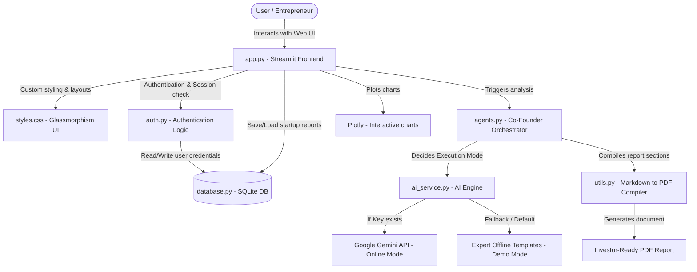
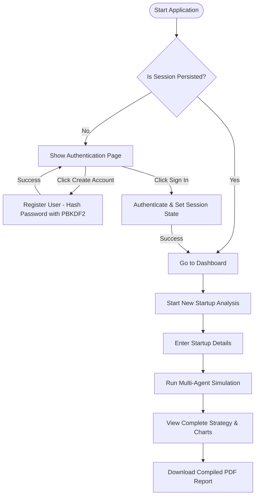

# 🚀 FoundrAI – AI Startup Co-Founder & Advisor

FoundrAI is a production-quality, multi-agent co-founder simulation dashboard designed to help early-stage entrepreneurs brainstorm, validate, and document their startup concepts. 

By leveraging an orchestrated boardroom pipeline of **12 specialized AI agents**, FoundrAI guides you from a raw idea to structured GTM checklists, 3-year interactive financial forecasts, and professional investor-ready PDF reports.

---

## 🛡️ Technology Stack


---

## 📊 System Architecture & Data Flow

FoundrAI is structured modularly to decouple UI logic, user security, database persistence, multi-agent prompts, and document compiling.

### 1. Application Layer Blueprint


### 2. Multi-Agent Boardroom Sequence
```mermaid
sequenceDiagram
    autonumber
    actor User as Entrepreneur
    participant App as Dashboard (app.py)
    participant Engine as Agent Orchestrator (agents.py)
    participant Gemini as Gemini AI Service (ai_service.py)
    database DB as SQLite Database (database.py)

    User->>App: Input Startup Details (Name, Description, Industry, Target Audience)
    App->>Engine: Run Boardroom Simulation
    Note over Engine: Iterates through 12 co-founder agents sequentially
    loop For each of the 12 Agents
        Engine->>Gemini: Query Agent Prompt (Role Context & Persona)
        Gemini-->>Engine: Structured Feedback (JSON & Markdown)
        Engine->>App: Update Progress UI (Real-time agent execution status)
    end
    Note over Engine: Consolidate responses & compute financial values
    Engine->>DB: Save Completed Co-Founder Report
    Engine-->>App: Display Boardroom Dashboard & Plotly Charts
    App->>User: Render Interactive Report & PDF Download Button
```

### 3. User Setup & Analysis Workflow


---

## 🛠️ Detailed Feature Guide

### 1. Secure Local Authentication
- **SQLite Storage**: Maintains a lightweight relational database ([database.py](file:///c:/Users/shivani%20Raj/.gemini/antigravity-ide/scratch/FoundrAI/database.py)) storing users and generation histories.
- **Cryptography**: Protects passwords using a random 16-byte salt and **PBKDF2-HMAC-SHA256** key derivation with 100,000 iterations.
- **Session Management**: Integrates secure state routing in [auth.py](file:///c:/Users/shivani%20Raj/.gemini/antigravity-ide/scratch/FoundrAI/auth.py) preventing unauthorized access to the analysis pipeline.

### 2. The 12-Agent Board of Co-Founders
The dashboard brings 12 specialized co-founders to the virtual table, each addressing a critical layer of startup building:
1. **Startup Idea Validator**: Computes feasibility and validation alignment.
2. **Market Research Agent**: Calculates market sizes (TAM, SAM, SOM) and growth parameters.
3. **Competitor Analysis Agent**: Evaluates competitor strengths, weaknesses, and unaddressed gaps.
4. **SWOT Analysis Agent**: Structures a Strengths, Weaknesses, Opportunities, and Threats canvas.
5. **Business Model Generator**: Maps out the Business Model Canvas parameters (value prop, partners, costs).
6. **Revenue Strategy Agent**: Tailors subscription tiers, ACVs, pricing metrics, and monetization channels.
7. **MVP Planner**: Structures a 12-week MVP development roadmap and recommends a tech stack.
8. **Go-To-Market Strategy Agent**: Creates launch campaigns, organic growth channels, and execution checklists.
9. **Financial Forecast Agent**: Projects 3-year revenues, expenses, and profits.
10. **Funding Strategy Agent**: Formulates seed target allocations, runway goals, and SAFE valuations.
11. **Risk Assessment Agent**: Formulates risk mitigation plans (operational, technical, and regulatory).
12. **Investor Pitch Generator**: Formulates a 10-slide deck outline and elevator pitch.

### 3. Dual Engine Execution Mode
- **Online Gemini Mode**: Triggered automatically when a valid `GEMINI_API_KEY` is present in the `.env` configuration. It leverages `gemini-1.5-flash` to generate context-specific, creative analysis tailored exactly to user inputs.
- **Offline Demo Mode (Default)**: If no key is set or the API request fails, the application switches to Demo Mode. It uses rich industry templates across **SaaS, Fintech, Healthtech, E-commerce, AI/Deeptech, and CleanEnergy** to guarantee an uninterrupted, bug-free dashboard experience.

### 4. Interactive Financial Visuals
- Dynamic visual rendering using **Plotly**.
- Generates 3-year projected financial forecasts, automatically reading the results of the Financial Forecast Agent.
- Plots revenue, expenses, and net profit comparisons on interactive bar charts.

### 5. Professional Report Compiler (PDF)
- Compiled dynamically using **ReportLab** Flowables in [utils.py](file:///c:/Users/shivani%20Raj/.gemini/antigravity-ide/scratch/FoundrAI/utils.py).
- Formats Markdown generated by the co-founders into styled sections.
- Incorporates custom color branding, page numbers, dynamic spacing, and tables to ensure a clean executive layout.

---

## 📂 Project Structure

```
FoundrAI/
├── .streamlit/
│   └── config.toml         # Custom Streamlit UI styling & theme settings
├── assets/
│   └── images/
│       └── logo.png        # Dynamically loaded brand logo asset
├── database.py             # SQLite setup, PBKDF2 password hashing, user records, and report save/fetch
├── auth.py                 # Centered Sign-in/signup UI and session state security checks
├── ai_service.py           # Google Gemini API configuration, status check, and fallback logic
├── agents.py               # 12 specialized co-founder personas, prompt templates, and Offline Demo templates
├── utils.py                # Text parser and ReportLab flowable PDF compiler
├── styles.css              # Custom CSS styling (glassmorphism cards, sidebar layouts, buttons)
├── requirements.txt        # Python package dependencies
├── .env.example            # Environment variables example template
├── README.md               # Extensive project documentation & guides
└── app.py                  # Streamlit dashboard entrypoint and main page views
```

---

## 🚀 Getting Started & Local Setup

### 1. Clone the Codebase
Navigate to your desired workspace and pull the project:
```bash
git clone <your-repository-url>
cd FoundrAI
```

### 2. Set Up Virtual Environment (Recommended)
```bash
# Windows
python -m venv .venv
.venv\Scripts\activate

# macOS/Linux
python3 -m venv .venv
source .venv/bin/activate
```

### 3. Install Dependencies
```bash
pip install -r requirements.txt
```

### 4. Configure Environment Variables
Create a local `.env` file to support Gemini API connectivity:
```bash
# Windows Powershell
copy .env.example .env

# Linux/macOS/Git Bash
cp .env.example .env
```
Edit the `.env` file and input your key:
```ini
GEMINI_API_KEY=AIzaSy...your_api_key_here...
```
*Note: If `GEMINI_API_KEY` is omitted or empty, the application launches smoothly in Offline Demo Mode using pre-compiled templates.*

### 5. Launch the Application
Start the Streamlit web server:
```bash
streamlit run app.py
```
Open your browser and navigate to `http://localhost:8501`.

---

## ☁️ Deployment Instructions (Streamlit Community Cloud)

FoundrAI is optimized to run on Streamlit Cloud using its native dependency parser and secrets manager.

1. **Push Code to GitHub**: Make sure all local files are committed and pushed to your public GitHub repository.
2. **Access Streamlit Cloud**: Go to [share.streamlit.io](https://share.streamlit.io/) and authenticate using your GitHub account.
3. **Deploy App**:
   - Click **New App**.
   - Choose your repository, branch (usually `master` or `main`), and specify the entrypoint file path as `app.py`.
4. **Configure Secrets**:
   - To enable Online Gemini mode, click **Advanced settings...** before deploying.
   - In the **Secrets** text box, add your API key in TOML format:
     ```toml
     GEMINI_API_KEY = "your_actual_gemini_api_key"
     ```
   - Click **Save**.
5. **Launch**: Click **Deploy**. Streamlit will provision a container, install packages listed in `requirements.txt`, and host your platform.
